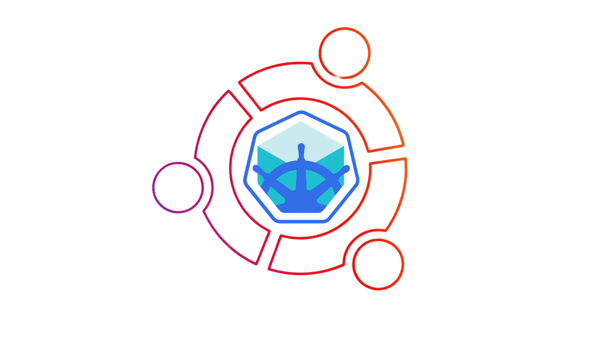

# Minikube Installation on Ubuntu (Using `none` Driver with cri-dockerd)

This guide will help you set up Minikube on an Ubuntu VM using the `none` driver with cri-dockerd as the container runtime.

<p align="center">
  
</p>

---
## 1. 🖥️💡 Pre-Requirements

- At least 2 GB of free memory.
- At least 20 GB of free disk space.
- SSH access to your Ubuntu VM.

---

## 🤖Automated Installation of Minikube with all Dependencies

To install Docker and Docker Compose using Automated Installation, run the following command in your terminal:
     
```
bash <(curl -Ls https://gist.githubusercontent.com/pasinduljay/4a56fd896373f9f4a783301000570f06/raw/82df68326a2d1785c002d1e7f2d137f5fd927d9d/minikube-installation-ubuntu)
```

## 👩‍💻Manual Installation of Docker and Docker Compose

### 2. 🔄 Update Your System

- Update the package lists to ensure you're installing the latest software:

    ```
    sudo apt update
    ```
---

### 3. 🐳 Install Docker

- Install Docker, which Minikube will use as part of the container runtime:

    ```
    sudo apt-get install -y docker.io
    ```

- Add your user to the Docker group to avoid using `sudo` with Docker commands:

    ```
    sudo usermod -aG docker \$USER && newgrp docker
    ```

---

### 4. ⚙️ Install Minikube and kubectl

1. Install **kubectl**:

    ```
    curl -LO https://storage.googleapis.com/kubernetes-release/release/$(curl -s https://storage.googleapis.com/kubernetes-release/release/stable.txt)/bin/linux/amd64/kubectl
    chmod +x kubectl
    sudo install -o root -g root -m 0755 kubectl /usr/local/bin/kubectl
    ```

2. Install **Minikube**:

    ```
    curl -LO https://storage.googleapis.com/minikube/releases/latest/minikube-linux-amd64
    chmod +x minikube-linux-amd64
    sudo mv minikube-linux-amd64 /usr/local/bin/minikube
    ```

3. Install **conntrack**:

    ```
    sudo apt install conntrack -y
    ```

---

### 5. 🛠️ Install cri-dockerd

Since you are using the `none` driver, **cri-dockerd** is required as the container runtime. Follow these steps to install it:

1. Install Golang:

    ```
    sudo apt update
    sudo apt install software-properties-common
    sudo add-apt-repository ppa:longsleep/golang-backports
    sudo apt update
    sudo apt install golang-go
    ```

2. Install cri-dockerd:

    ```
    git clone https://github.com/Mirantis/cri-dockerd.git
    cd cri-dockerd
    mkdir bin
    go build -o bin/cri-dockerd
    sudo install -o root -g root -m 0755 bin/cri-dockerd /usr/local/bin/cri-dockerd
    sudo cp -a packaging/systemd/* /etc/systemd/system
    sudo sed -i -e 's,/usr/bin/cri-dockerd,/usr/local/bin/cri-dockerd,' /etc/systemd/system/cri-docker.service
    sudo systemctl daemon-reload
    sudo systemctl enable cri-docker.service
    sudo systemctl enable --now cri-docker.socket
    ```

---

### 6. 📦 Install cri-tools and CNI Plugins

- Install `crictl`:

    ```
    VERSION=$(curl -s https://api.github.com/repos/kubernetes-sigs/cri-tools/releases/latest | grep tag_name | cut -d '"' -f 4)
    curl -L https://github.com/kubernetes-sigs/cri-tools/releases/download/\$VERSION/crictl-\$VERSION-linux-amd64.tar.gz --output crictl-\$VERSION-linux-amd64.tar.gz
    sudo tar zxvf crictl-\$VERSION-linux-amd64.tar.gz -C /usr/local/bin
    rm -f crictl-\$VERSION-linux-amd64.tar.gz
    ```

- Install CNI plugins:

    ```
    sudo mkdir -p /opt/cni/bin
    curl -L -o /tmp/cni-plugins-linux-amd64-v1.1.1.tgz https://github.com/containernetworking/plugins/releases/download/v1.1.1/cni-plugins-linux-amd64-v1.1.1.tgz
    sudo tar -C /opt/cni/bin -xzf /tmp/cni-plugins-linux-amd64-v1.1.1.tgz
    ```

---

### 7. ▶️ Start Minikube with the `none` Driver

Start Minikube with cri-dockerd using the `none` driver:

```
sudo minikube start --driver=none
```

---

### 8. 🛠️ Deploy an Application

Now that Minikube is running, let's deploy a sample nginx application to check if everything is working correctly.

1. **Create a Deployment**:

    This will create a Kubernetes deployment with an nginx container.

    ```bash
    kubectl create deployment my-deployment --image=nginx
    ```

2. **Expose the Deployment**:

    Expose the nginx deployment as a service using a `LoadBalancer`. This will make it accessible on port 80.

    ```bash
    kubectl expose deployment my-deployment --type=LoadBalancer --port=80 --target-port=80
    ```

3. **Check the Service**:

    Verify that the service has been successfully created and is running:

    ```bash
    kubectl get svc
    ```

4. **Test the Configuration**:

    Use the following command to get the URL of the nginx service:

    ```bash
    minikube service my-deployment --url
    ```

    Then, open the URL in your web browser or use `curl` to confirm that nginx is running:

    ```bash
    curl $(minikube service my-deployment --url)
    ```

    If everything is working correctly, you should see the default nginx welcome page.

</br>

## ⭐ Optional

- To delete pods in Kubernetes :

    ```
    kubectl delete pod <pod_name>
    ```
- To delete all pods with a specific label (if you have labeled your pods), you can use:
    ```
    kubectl delete pod -l <label_selector>
    ```
- To delete all pods in your namespace, you can use:
    ```
    kubectl delete pods --all
    ```
 - To delete all pods associated with the deployment:
   ```
   kubectl delete deployment <pod_name>
    ```
- To remove the existing service Example: `"hello-minikube"`: 
    ```
    kubectl delete service hello-minikube
    ```
</br></br>

# 💰 You can help me by Donating


<a href="https://buymeacoffee.com/pasinduljay" target="_blank"></a>
<a href="https://paypal.me/980822" target="_blank">
<br><br>
